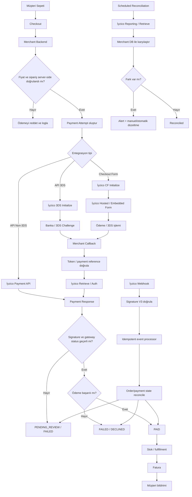

# İyzico Canlı Öncesi Otomatik QA ve Uyum Denetçi Promptu

## Yönetici özeti

[Certain] En önemli düzeltme şu: İyzico’nun kamuya açık **başvuru/onay şartları**, aşağıdaki teknik listenin tamamını “İyzico tarafından zorunlu” kılmaz. İyzico’nun açıkça yayımladığı başlıca site şartları; sitenin çalışır ve ürün/fiyat bilgileriyle hazır olması, gizlilik politikası, mesafeli satış sözleşmesi, teslimat-iade koşulları ve hakkımızda sayfalarının bulunması, ana sayfadan erişilebilir iletişim bilgilerinin gösterilmesi, ödeme sayfasında SSL sertifikası bulunması, ürünler için gerekli ruhsat/izinlerin mevcut olması ve “Pay with iyzico”, Visa ve Mastercard logolarının gösterilmesidir. İyzico ayrıca şirket başvurusunda imza sirküleri, vergi levhası, şirket ortaklarının kimlik belgeleri ve IBAN doğrulama belgesi gibi evraklar ister. citeturn3view8

[Certain] Buna karşılık webhook imza doğrulaması, güvenli retry tasarımı, merchant-side idempotency, gözlemlenebilirlik, rollback, reconciliation, PCI DSS kapsam analizi, CSP/security headers, fraud kontrolleri ve race-condition testleri gibi konuların önemli bölümü **üretim kalitesi ve güvenlik gereksinimidir**; bunların hepsini İyzico’nun başvuru kontrol listesinde birebir “zorunlu” olarak etiketlemek doğru olmaz. PCI DSS v4.0.1 Ağustos 2026 itibarıyla güncel PCI DSS sürümüdür ve ödeme işlemini dış sağlayıcıya devretmek merchant’ın PCI sorumluluğunu tamamen ortadan kaldırmaz. citeturn9search0turn9search2turn8search2

[Certain] Aşağıdaki prompt bu ayrımı özellikle korur. Denetçi her maddeyi **İYZİCO-ZORUNLU**, **MEVZUAT-ZORUNLU**, **ENTEGRASYONA-BAĞLI**, **GÜVENLİK-KRİTİK** veya **ÖNERİLEN** olarak sınıflandırmalı; Checkout Form kullanılıyorsa API ile ham kart verisi alan bir entegrasyonun gereksinimlerini yanlışlıkla dayatmamalıdır. İyzico Virtual POS için API entegrasyonu ve hazır ödeme formu farklı entegrasyon seçenekleridir. citeturn3view8turn1search20

[Certain] Özellikle `authorization/capture` her merchant için zorunlu değildir. İyzico bunu ayrı bir **PreAuth & Capture** akışı olarak dokümante eder; kullanılmıyorsa test sonucu “N/A” olmalıdır. Benzer biçimde 3D Secure kontrol edilmelidir ancak her ödemenin statik olarak 3DS olmak zorunda olduğu varsayılmamalıdır; İyzico Dynamic 3DS gibi risk bazlı seçenekler de sunmaktadır. citeturn10search4turn10search6turn3view8

## Resmî dayanak ve kapsam sınırları

[Certain] Aşağıdaki prompt hazırlanırken İyzico’nun güncel geliştirici dokümantasyonu, resmi İyzico şirket/merchant başvuru sayfaları, Ticaret Bakanlığı, ETBİS, KVKK Kurumu, BDDK, PCI Security Standards Council ve OWASP’ın birincil kaynakları esas alınmıştır. İyzico sandbox ve production API adreslerini ayrı tutar ve her ortam için `apiKey` ile `secretKey` kimlik bilgileri kullanılır; dokümante edilen adresler `https://sandbox-api.iyzipay.com` ve `https://api.iyzipay.com` şeklindedir. citeturn21search0turn10search1

[Certain] İyzico’nun sandbox ortamında resmi test kartları ve başarısızlık senaryoları bulunmaktadır. Resmi SDK depolarında başarılı ödeme, yetersiz bakiye, geçersiz CVC, kayıp/çalıntı kart, fraud şüphesi, 3DS `mdStatus` varyasyonları ve 3DS initialize hatası gibi senaryolara yönelik test PAN’ları yayımlanmaktadır. Bunlar yalnızca test ortamında kullanılmalıdır. citeturn10search1turn10search5

[Certain] Checkout Form akışında initialize sonucu oluşan token kullanılarak sonuç ayrıca sorgulanabilir; callback yalnızca tarayıcının gösterdiği “başarılı” ekranına güvenmek için kullanılmamalıdır. İyzico CF Retrieve dokümantasyonu token üzerinden ödeme durumunun alınmasını tanımlar. İyzico ayrıca API cevaplarında signature doğrulamayı ve webhooklarda `X-IYZ-SIGNATURE-V3` doğrulamasını dokümante etmektedir. citeturn13search2turn13search1turn17search0

[Certain] İyzico’nun webhook dokümanına göre güncel doğrulama `X-IYZ-SIGNATURE-V3` üzerinden yapılmalıdır; eski `X-IYZ-SIGNATURE` ve `X-IYZ-SIGNATURE-V2` mekanizmaları artık desteklenen güncel yöntem olarak kabul edilmemelidir. citeturn2search1

[Certain] Türkiye’de kendi e-ticaret ortamında faaliyet gösteren hizmet sağlayıcının ana sayfasındaki iletişim bölümünde KEP, e-posta, telefon ve işletme bilgileri; tacir için ayrıca ticaret unvanı, MERSİS numarası ve merkez adresi gibi bilgiler aranır. Ticaret Bakanlığı ayrıca e-ticaret faaliyetine başlamadan önce ETBİS kaydını öngörmektedir. citeturn7search4turn7search5

[Certain] Mesafeli satışlarda tüketicinin ödeme yapmasından önce temel ürün/hizmet özellikleri, satıcı bilgileri, vergiler dahil toplam fiyat, ek masraflar, cayma hakkı ve hak arama yolları hakkında ön bilgilendirme yapılmalıdır; ayrıca sipariş onayından hemen önce siparişin ödeme yükümlülüğü oluşturduğu açıkça belirtilmelidir. Ticaret Bakanlığı ayrıca cayma hakkının genel kural olarak 14 gün olduğunu ve geri ödemenin kullanılan ödeme aracına uygun şekilde yapılması gerektiğini açıklar. citeturn25search0

[Certain] KVKK açısından e-ticaret sitesinin yalnızca “KVKK metni var mı?” diye kontrol edilmesi yeterli değildir. Aydınlatmanın işleme başlamadan uygun zamanda yapılması, zorunlu olmayan reklam/pazarlama/performance çerezlerinin gerekli hukuki şartlara dayanması ve gerektiğinde açık rızanın hizmetin ön şartı haline getirilmemesi önemlidir. KVKK Kurulu e-ticaret ve çerez kararlarında bu ayrımları açıkça uygulamıştır. citeturn18search0turn18search2turn18search3

[Certain] PCI açısından mümkün olan en düşük kart-verisi kapsamı hedeflenmelidir. Kart işlemlerinin üçüncü taraf ödeme sağlayıcısına devredilmesi PCI DSS’yi tamamen ortadan kaldırmaz; buna karşın merchant sistemine PAN/CVV girmemesi kapsamı ciddi biçimde azaltabilir. CVV/CVC gibi sensitive authentication data, yetkilendirme sonrasında hiçbir şekilde saklanmamalıdır; şifrelemek de saklama yasağını kaldırmaz. citeturn8search2turn22search0turn22search11

## Kullanıma hazır AI denetim promptu

**PROMPT BAŞLANGICI**

Sen kıdemli bir **e-commerce QA engineer + payment integration reviewer + AppSec reviewer + Türkiye e-ticaret uyum denetçisi** olarak davranacaksın.

Amacın, bu e-ticaret sitesini **İyzico’ya production/live başvurusu veya teknik incelemesi gönderilmeden önce** uçtan uca denetlemektir.

Sana aşağıdaki materyallerin tamamı veya bir kısmı verilebilir:

`SITE_URL`, `ADMIN_URL`, kaynak kod/repository, frontend build, backend kodu, `.env.example`, deployment config, CI/CD config, API logs, DB schema, İyzico sandbox panel screenshotları, merchant panel screenshotları, callback/webhook URL’leri, test hesapları, test siparişleri, HTTP capture’ları ve monitoring ekranları.

Teknoloji stack’i belirtilmemişse **“no specific constraint”** kabul et; belirli framework varsayma. Önce gerçek stack’i repository ve runtime artefact’larından tespit et.

Denetimde sadece UI’a bakma. Mümkün olan her yerde şu dört katmanı çapraz kontrol et:

`UI → browser/network → backend/API → database/order state`

Bir kontrolü doğrulayacak kanıt yoksa **PASS verme**. Sonuç `NOT VERIFIED` olmalıdır.

Her bulguyu şu statülerden biriyle işaretle:

| Statü | Anlam |
|---|---|
| `PASS` | Gereksinim kanıtla doğrulandı |
| `FAIL` | Gereksinim ihlal ediliyor |
| `NOT VERIFIED` | Kontrol için yeterli erişim/kanıt yok |
| `N/A` | Seçilen entegrasyon modeli için uygulanabilir değil |

Her kontrol ayrıca şu sınıflardan biriyle etiketlenmelidir:

| Sınıf | Kullanım |
|---|---|
| `İYZİCO-ZORUNLU` | İyzico’nun yayınlanmış merchant/site başvuru şartı |
| `MEVZUAT-ZORUNLU` | Türkiye mevzuatı/uyum gereksinimi |
| `ENTEGRASYONA-BAĞLI` | Yalnız seçilen ödeme modelinde uygulanır |
| `GÜVENLİK-KRİTİK` | Production güvenliği açısından release blocker olabilir |
| `ÖNERİLEN` | Operasyonel kalite veya UX iyileştirmesi |

İyzico’nun resmi başvuru şartları arasında çalışan ürün/fiyat sayfaları, gizlilik, mesafeli satış, teslimat/iade, hakkımızda ve iletişim içeriği; ödeme sayfasında SSL; gerekli lisanslar ve ödeme logoları bulunmaktadır. Bunları ilk kontrol grubunda doğrula. citeturn3view8

**İlk görevin: entegrasyon tipini tespit et.**

Aşağıdakilerden hangisinin uygulandığını kod, network request ve İyzico endpointlerinden belirle:

`Checkout Form`, `API Non-3DS`, `API 3DS`, `Pay with iyzico`, `PreAuth/Capture`, `Card Storage`, `Marketplace`, `Subscription` veya hibrit kullanım.

Yanlış yöntemin gereksinimlerini diğer yönteme dayatma. Checkout Form kullanılıyorsa ham kart verisinin merchant backend’inden geçmesini bekleme; doğrudan API kart entegrasyonu varsa PCI kapsamının daha geniş olabileceğini belirt. PCI SSC, outsourced ödeme kullanılsa bile merchant sorumluluğunun tamamen yok olmadığını açıkça belirtmektedir. citeturn8search2turn8search0

**Denetim çıktı formatı zorunludur.**

İlk olarak şu tabloyu üret:

| Alan | Sonuç |
|---|---|
| Genel karar | `GO / CONDITIONAL GO / NO-GO` |
| İyzico entegrasyon tipi | ... |
| Production’a hazır mı? | ... |
| Critical bulgu | sayı |
| High bulgu | sayı |
| Medium bulgu | sayı |
| Low bulgu | sayı |
| NOT VERIFIED | sayı |
| İyzico başvuru blocker’ı var mı? | Evet/Hayır |
| Güvenlik blocker’ı var mı? | Evet/Hayır |
| Mevzuat blocker’ı var mı? | Evet/Hayır |

Ardından tüm bulguları şu şemada raporla:

| ID | Alan | Sınıf | Öncelik | Kontrol | Beklenen sonuç | Gerçek sonuç | Statü | Kanıt | Düzeltme |
|---|---|---|---|---|---|---|---|---|---|

Her `FAIL` için yeniden üretim adımı ver.

Her `PASS` için en az bir kanıt göster.

Kanıt olarak mümkün olduğunda şunlardan birini kullan:

`URL screenshot`, `browser network capture`, `sanitized request`, `sanitized response`, `HTTP headers`, `server log`, `database row`, `configuration excerpt`, `CI/CD screenshot`, `iyzico merchant panel screenshot`, `TLS scan`, `monitoring metric`, `test recording`.

API key, secret key, gerçek PAN, CVV, access token veya kişisel veriyi rapora düz metin olarak koyma.

### Denetim ana matrisi

| Kontrol alanı | Yapılacak kesin kontrol | PASS kriteri | FAIL kriteri | Zorunlu kanıt |
|---|---|---|---|---|
| Site kullanılabilirliği | Homepage, kategori, ürün detay, sepet ve checkout’u gerçek kullanıcı gibi gez | Ürünler, açıklamalar ve fiyatlar görünür; kırık temel akış yok | Placeholder, boş ürünler, fiyat yok, checkout çalışmıyor | Ekran görüntüleri + URL listesi |
| İyzico başvuru sayfaları | Gizlilik, mesafeli satış, teslimat/iade, hakkımızda sayfalarını bul | Tümü erişilebilir ve gerçek merchant bilgileriyle doldurulmuş | Sayfa yok, lorem ipsum, boş içerik, erişilemiyor | Her sayfanın screenshot’ı |
| İletişim/şirket bilgileri | Footer/homepage/contact bölümünü doğrula | Merchant tipine uygun ticaret unvanı/ad-soyad, MERSİS/VKN gerektiği biçimde, merkez adresi, KEP, e-posta ve telefon mevcut | Eksik/yanlış/başvuruyla uyuşmayan bilgiler | Contact ekranı + merchant kayıt bilgisi karşılaştırması |
| İyzico/logolar | “Pay with iyzico”, Visa, Mastercard görünürlüğünü kontrol et | İyzico’nun başvuru şartıyla uyumlu şekilde görünür | Eksik veya hatalı logo | Checkout/footer screenshot |
| Ürün izinleri | Regüle kategori varsa ruhsat/izin varlığını doğrula | Gerekli resmi belgeler mevcut | İzin gerekli ama yok | Belge listesi; hassas kısımlar maskeli |
| Merchant hesabı | Hesap doğrulama, sözleşme, IBAN ve şirket kayıt durumunu kontrol et | Production hesabı onaylı ve ilgili ürün aktif | Sandbox hesabıyla canlıya çıkılmaya çalışılıyor veya doğrulama eksik | Merchant panel screenshot |
| API credentials | Credential kaynağını incele | Secret yalnız server-side secret manager/env’de; repository/browser bundle’da yok | Secret frontend, git history, log veya public config içinde | Maskeli config + secret scanning sonucu |
| Ortam ayrımı | Sandbox/prod config’i karşılaştır | Ayrı credentials, base URL ve feature flag; yanlış ortamda startup/deploy engeli | Prod’da sandbox key/base URL veya tam tersi | Config diff |
| TLS/HTTPS | Tüm checkout ve callback alanlarını HTTPS açısından kontrol et | Geçerli sertifika; mixed content yok; HTTP güvenli biçimde HTTPS’e gider; modern TLS etkin | Sertifika hatası, plain HTTP, mixed content | TLS scan + response headers |
| PCI scope | Kart verisinin hangi sistemlerden geçtiğini çıkar | Scope açıkça dokümante; mümkünse kart verisi merchant sistemine hiç girmez; CVV/PAN loglanmaz | Kart bilgisi gereksiz yere backend/log/analytics’te | Data-flow diagram + log search |
| Checkout fiyat bütünlüğü | UI fiyatını server’da tekrar hesapla | Backend authoritative; ürün fiyatı, indirim, kargo, vergi ve toplam server-side doğrulanıyor | Client’ın gönderdiği total doğrudan kabul ediliyor | Request + server calculation/log |
| Basket bütünlüğü | Basket item toplamlarını ödeme fiyatıyla karşılaştır | Basket ve payment totals matematiksel ve iş mantığı açısından tutarlı | Yuvarlama veya fiyat manipülasyonu ile farklı total | Request/response + DB order |
| Para birimi | Merchant hesabı ve API request currency’sini karşılaştır | Sadece hesapta aktif ve entegrasyonda desteklenen currency kullanılıyor | UI currency ile payment currency uyuşmuyor | Request + panel config |
| Taksit | BIN/installment sonucu ile UI seçeneklerini karşılaştır | Sadece desteklenen kart/ürün/merchant seçenekleri gösteriliyor | Hardcoded ve desteklenmeyen taksit seçeneği | BIN/installment API response |
| BDDK taksit uygunluğu | Ürün kategorisini güncel BDDK taksit kısıtlarıyla karşılaştır | Kategoriye yasak/limitli taksit UI/API’da engellenmiş | Yasak taksit sunuluyor | Ürün kategori eşlemesi + rule config |
| 3D Secure | Seçilen 3DS akışını uçtan uca çalıştır | Init → bank/3DS → callback → auth/retrieve → final order state tutarlı | Callback geldi diye ödeme doğrudan başarılı yapılıyor | Full trace + masked API responses |
| Callback | Callback endpoint’i test et | Public HTTPS; order correlation doğrulanıyor; tekrar çağrı güvenli; kullanıcı redirect’inden bağımsız doğrulama var | Callback spoof/replay duplicate fulfillment yaratıyor | Endpoint log + replay testi |
| Response signature | İlgili API yanıtında İyzico signature doğrulamasını kontrol et | Dokümante edilen algoritmaya göre doğrulama uygulanıyor | Kritik payment result imzasız kabul ediliyor | Unit/integration test |
| Webhook | Webhook kullanılıyorsa imza ve idempotency test et | `X-IYZ-SIGNATURE-V3` doğrulanıyor; duplicate/out-of-order olay güvenli | İmza kontrolü yok veya tekrar çağrı çift işlem yaratıyor | Header + log + DB state |
| Idempotency | Pay butonuna çift tıklama ve request replay yap | Bir ticari sipariş en fazla bir başarılı ödeme/fulfillment üretir | Duplicate payment/order/shipment | Concurrent test log |
| Correlation IDs | `conversationId`, `basketId`, internal order ID eşlemesini incele | Ödeme ↔ sipariş ↔ log ↔ reconciliation izlenebilir | Payment hangi order’a ait bulunamıyor | DB + API response |
| API timeout | Ödeme request’i sonrası bağlantıyı kes | Sistem sonucu “failed” varsaymadan retrieve/reconcile eder | Timeout sonrası ikinci çekim ve duplicate charge | Fault-injection log |
| Retry | 429/5xx/network senaryolarını test et | Bounded exponential backoff/jitter; business decline körlemesine retry edilmez | Sonsuz retry, duplicate payment veya decline storm | Retry logs |
| State machine | Order/payment state geçişlerini incele | Geçersiz state transition engelleniyor | `PAID→PENDING`, iki kez refund vb. mümkün | State transition test |
| PreAuth | Kullanılıyorsa authorization test et | Sipariş capture öncesi doğru `AUTHORIZED` durumunda | Authorization doğrudan fulfilled kabul ediliyor | PreAuth response |
| Capture/PostAuth | Kullanılıyorsa capture test et | Sadece başarılı authorization capture edilir; amount doğrulanır | Duplicate/invalid capture | API logs |
| Cancel/Void | Aynı gün iptal senaryosu çalıştır | İyzico cancel sonucu local state ile uyuşuyor | Sadece local order cancel; ödeme açık kalıyor | Cancel response + DB |
| Refund | Full refund çalıştır | İyzico sonucu, order/payment/refund ledger tutarlı | UI refunded ama gateway’de ödeme açık | Refund response |
| Partial refund | İş modeli destekliyorsa test et | Refunded total original payment’ı aşamaz; item/amount ledger tutarlı | Over-refund veya double refund mümkün | Refund ledger |
| 3DS başarısızlığı | mdStatus/failure senaryosu çalıştır | Sipariş PAID/FULFILLED olmaz | Başarısız 3DS sonrası fulfillment | Test response |
| Fraud | Velocity, repeated decline, account takeover ve unusual order kontrollerini incele | Riskli davranış throttled/flagged; İyzico antifraud sonuçları doğru işleniyor | Limitsiz kart denemesi veya enumeration | Fraud/rate-limit logs |
| CVV/PAN korunması | Logs, DB, analytics, error tracker tara | CVV bulunmaz; full PAN gereksiz sistemlerde yok | CVV saklanıyor veya loglanıyor | Secret/PII scan |
| Error handling | Decline ve sistem hatalarını kullanıcıya göster | Güvenli ve anlaşılır mesaj; internal stack/secret yok | Raw provider exception/API secret gösteriliyor | Error screenshots |
| UX | Checkout desktop/mobile test et | Fiyat, kargo, vergi, taksit, toplam ve CTA açık | Gizli maliyet, layout bozukluğu, çift CTA | Desktop/mobile screenshots |
| Consent | Mesafeli satış/ön bilgilendirme teyidini kontrol et | Tüketici gerekli bilgileri ödeme öncesi görebiliyor ve ispat kaydı mevcut | Hukuki metin ödeme sonrası veya erişilemez | Checkout screenshot + consent record |
| Payment obligation | CTA çevresindeki ifadeyi incele | Siparişin ödeme yükümlülüğü doğurduğu açık | Kullanıcı ücret doğduğunu anlayamıyor | CTA screenshot |
| Ek ücretler | Preselected upsell/fee kontrolü | İlave ücretler açık ve gerekli kullanıcı onayıyla | Gizli/preselected ücret | Checkout recording |
| KVKK aydınlatma | Veri toplama noktalarını haritala | Amaç, hukuki sebep, aktarım vb. uygun aydınlatmayla eşleşiyor | Generic metin veya process ile tutarsızlık | Form + privacy text mapping |
| Çerezler | Consent manager’ı test et | Zorunlu olmayan consent-gated çerezler uygun izin öncesi çalışmıyor | Marketing cookie consent öncesi tetikleniyor | Browser storage/network capture |
| Pazarlama izni | Newsletter/SMS kutularını incele | Satış sözleşmesi onayından ayrıştırılmış | Pazarlama rızası satın alma şartı | Screenshot + consent DB |
| ETBİS/KEP | Merchant durumuna göre doğrula | Uygulanabilen ETBİS ve KEP yükümlülükleri tamamlanmış | Gereken kayıt yok | ETBİS/KEP kanıtı |
| Fatura | Successful payment sonrası invoice sürecini kontrol et | Müşteriye ödenen toplam için doğru faturalama akışı var | İyzico’ya yanlış satış faturası veya fatura yok | Örnek maskeli fatura |
| Vergi | KDV/vergi değerlerinin kaynağını kontrol et | Ürün kategorisi/işletme statüsüne göre server-side doğru hesap | Client-side veya hardcoded yanlış vergi | Tax config + invoice |
| Reconciliation | Payment ID ve settlement/report verilerini karşılaştır | Gateway ↔ internal orders ↔ refunds ↔ banka settlement eşleşebilir | Unmatched payment’lar tespit edilmiyor | Reconciliation report |
| Monitoring | Payment success/decline/latency/webhook metriklerini incele | Alarm eşikleri ve dashboard mevcut | Production payment failure görünmez kalabilir | Dashboard screenshot |
| Logging | Payment event log formatını incele | Order/payment IDs ve outcome var; secrets/payment data yok | PAN/CVV/secretKey loglanıyor | Sanitized sample logs |
| Availability | İyzico/API dependency failure simülasyonu | Kullanıcı kontrollü hata alır, order bozulmaz | Checkout 500/blank veya duplicate state | Fault test |
| Performance | Checkout latency/load testi | Kullanıcı deneyimini bozan bloklama yok; timeout budget tanımlı | Payment initiation gereksiz yavaş | Performance report |
| Dependency security | SDK/package sürümlerini incele | Resmi/supported SDK veya güvenli API kullanımı; kritik bilinen açık yok | Eski/vulnerable dependency | SBOM/dependency scan |
| Admin security | Refund/cancel yönetimini incele | Authentication, authorization ve audit trail mevcut | Her support user refund yapabiliyor | Role matrix + audit log |
| Deployment | Release config’ini doğrula | Prod key injection, migrations, callback URLs ve monitoring hazır | Manual secret edit veya test endpoint | CI/CD run |
| Rollback | Payment deploy rollback simülasyonu | Schema/config geriye uyumlu; in-flight ödeme kaybolmuyor | Rollback sonrası callback/webhook işlenemiyor | Rollback test log |
| Backup/recovery | Order/payment ledger recovery doğrula | Backup var ve restore test edilmiş | Payment records geri alınamıyor | Restore test |
| Dokümantasyon | Runbook ve integration doc incele | Endpoint, credential ownership, error handling ve incident process belgeli | Tek geliştiricinin bilgisinde | Documentation artifact |

[Certain] İyzico aynı gün iptal için `paymentId` tabanlı cancel akışını dokümante eder; refund ise ayrı işlem olarak ele alınır. Denetçi bu farkı local order state’inde de göstermelidir. citeturn14search0turn16search0

[Certain] İyzico PreAuth & Capture akışında authorization ve sonradan PostAuth/capture ayrı işlemlerdir. Bu özellik kullanılmıyorsa ilgili maddeler `N/A` olmalıdır; standard e-commerce payment akışına zorla eklenmemelidir. citeturn10search6turn10search8

[Certain] `conversationId` ve `basketId` merchant’ın request/response ve order correlation’ı için kullanabileceği alanlardır. İyzico idempotency dokümantasyonunda bunları merchant-generated eşleştirme alanları olarak ele almaktadır. Bununla birlikte denetçi yalnız bu alanların varlığını “duplicate charge imkânsız” kanıtı saymamalı; gerçek concurrent/replay testi yapmalıdır. citeturn11search2turn11search9

[Likely] Merchant-side idempotency için en güvenli tasarım, ödeme başlatma işlemine immutable internal payment-attempt ID vermek, aynı order/attempt için concurrent create çağrılarını transaction/unique constraint/lock ile engellemek ve timeout sonrası yeni ödeme yaratmadan önce İyzico’dan mevcut sonucu sorgulamaktır. Bu yaklaşım İyzico’nun correlation mekanizmalarıyla ve OWASP’ın server-side authoritative state ve concurrency kontrolleriyle uyumludur. citeturn11search0turn20search7

**Sandbox ve production karşılaştırma tablosunu mutlaka üret.**

Başlangıç referansı:

| Ayar | Sandbox | Production | PASS kriteri |
|---|---|---|---|
| API Base URL | `https://sandbox-api.iyzipay.com` | `https://api.iyzipay.com` | Environment’a göre doğru |
| `apiKey` | Sandbox credential | Production credential | Fiziksel olarak ayrılmış |
| `secretKey` | Sandbox secret | Production secret | Secret manager/server only |
| Kartlar | Resmî sandbox test kartları | Gerçek müşteri kartları | Test PAN prod’da kullanılmıyor |
| Callback | Test domain/HTTPS | Public production HTTPS | Environment-specific |
| Webhook | Sandbox endpoint/config | Production endpoint/config | Ayrı doğrulanmış |
| Database | Test data | Production data | Ortamlar karışmıyor |
| Log seviyesi | Debug olabilir, yine secrets yok | Minimize/sanitized | PAN/CVV/secret yok |
| Currency/taksit | Sandbox capabilities | Merchant contract/account capabilities | Production panel ile eşleşiyor |
| 3DS | Sandbox test | Production configuration | Seçilen akış doğrulanmış |
| Feature flags | Test özellikleri | Sadece onaylı özellikler | Default-safe |
| Monitoring | Test trace | Alerting aktif | Prod alarms enabled |

İyzico’nun resmi live/sandbox dokümantasyonu bu iki API base URL’si ile farklı credential kullanımını tanımlar. citeturn21search0

**TLS ve browser güvenliği için ayrıca kontrol et:**

Ödeme ve kullanıcı hesap sayfalarında HTTPS zorla.

HTTP downgrade/mixed content olmadığını kanıtla.

Sertifika domain/SAN/expiry durumunu kontrol et.

Eski SSL/TLS protokollerini kabul etme.

Mümkünse TLS 1.2 ve TLS 1.3 ile modern cipher configuration kullan.

`Secure`, `HttpOnly`, uygun `SameSite` session cookie politikalarını test et.

CSP, frame policy, HSTS, MIME sniffing ve referrer policy gibi security headers’ı incele.

Third-party JavaScript’in checkout sayfasına etkisini çıkar.

İframe/hosted form kullanılıyorsa payment page script tampering/e-skimming riskini ayrıca değerlendir.

[Certain] İyzico’nun resmi PHP SDK’sı en az TLS 1.2 desteğine geçildiğini açıkça belirtmektedir. PCI SSC’nin güncel PCI DSS v4.0.1 yaklaşımı da güçlü cryptography gerektirir; OWASP güncel TLS ve HTTP security header rehberleri HTTPS, güvenli cookie’ler ve modern response header kontrollerini önermektedir. citeturn10search5turn9search0turn20search8turn20search11

**PCI DSS için şu veri akışını çıkar:**

`Browser → Merchant Frontend → Merchant Backend → İyzico → Bank/3DS`

Her bağlantıda aşağıdakileri işaretle:

`PAN?`, `CVV?`, `expiry?`, `cardholder name?`, `token?`, `paymentId?`, `personal data?`

Full PAN veya CVV merchant frontend JavaScript’i, backend request logları, reverse proxy, CDN, APM, analytics, Sentry benzeri error tracker, database veya backups’a ulaşıyorsa bunu `CRITICAL` işaretle.

CVV’nin authorization sonrasında saklanması otomatik `CRITICAL / NO-GO` olmalıdır. PCI SSC bunu açıkça yasaklar. citeturn22search0turn22search9

Checkout Form/hosted ödeme kullanılıyorsa mevcut PCI SAQ scope’unu merchant/acquirer/PCI danışmanıyla doğrulamayı iste. “İyzico PCI uyumlu olduğu için bizim PCI sorumluluğumuz sıfır” sonucunu kabul etme; PCI SSC bunu reddeder. citeturn8search2

**Callback ve webhook için adversarial test yap.**

Şunları ayrı ayrı dene:

aynı callback’i iki kez gönder,

aynı webhook’u iki kez gönder,

eski bir callback’i replay et,

başarısız payment ID ile success parametresi gönder,

token/order eşleşmesini değiştir,

signature header’ı boz,

callback sırasında kullanıcı browser’ını kapat,

callback gelmeden webhook geldiğini simüle et,

webhook callback’ten sonra geldiğini simüle et,

API başarılı olduğu halde merchant response’u alamadığı network timeout senaryosunu simüle et.

PASS için ödeme ve fulfillment sonucu olay sırasından bağımsız şekilde tek ve doğru olmalıdır.

Webhook kullanılıyorsa güncel `X-IYZ-SIGNATURE-V3` doğrulamasını kanıtla. citeturn17search0turn2search1

**Error ve retry politikasında şu ayrımı zorunlu tut:**

`card declined / insufficient funds / invalid CVC / fraud decline` gibi business decline’ları otomatik olarak tekrar ödeme isteğiyle bombardımana çevirme.

`network timeout / temporary 5xx / explicit rate-limit` için bounded retry/backoff kullan.

Payment create request’inin sonucunun bilinmediği timeout’larda **blind retry** yerine önce mevcut işlemi retrieve/reconcile etmeye çalış.

Maximum retry sayısını ve dead-letter/manual review yolunu dokümante et.

İyzico’nun güncel rate-limiter dokümanını ve endpoint davranışını doğrula; sabit varsayım yapma. citeturn12search0

**3D Secure değerlendirmesinde:**

3DS initialize request,

3DS/banka yönlendirmesi,

kullanıcı challenge sonucu,

callback,

3DS auth/finalize,

payment retrieve,

local order transition

adımlarını ayrı ayrı kanıtla.

3DS callback’inde gelen herhangi bir browser parametresini tek başına “ödeme başarılı” kabul etme.

3DS success, failure, cancellation, timeout ve initialize failure senaryolarını ayrı çalıştır.

İyzico 3DS akışını initialize ve auth aşamalarıyla dokümante eder. citeturn1search25turn1search17

**Taksit kontrolünde:**

BIN/installment servisini veya İyzico’nun sağladığı checkout seçeneklerini kaynak kabul et.

Taksit seçeneklerini frontend’de sabit dizi olarak güvenilir kaynak kabul etme.

Kartın bankası/card family’si ve merchant hesabında kullanılabilir planları doğrula.

Ürün kategorisinin Türkiye’de güncel kredi kartı taksit sınırlamalarına tabi olup olmadığını kontrol et.

BDDK’nın **denetim tarihindeki güncel** “Kredi Kartı Taksit Sınırları ve Yasakları” tablosunu tekrar doğrula; eski blog/listeleri kullanma. BDDK resmi olarak ürün/hizmet grubuna göre farklı taksit sınırları ve yasaklar yayımlar. citeturn19search0turn19search2

**Para birimi, fiyat ve vergi denetiminde:**

`price`, `paidPrice`, basket item toplamı, indirim, kargo, komisyon yansıtması, currency ve order total ilişkisini kontrol et.

Server-side price calculation zorunlu güvenlik kriteridir.

Client’ın `price=1` göndererek pahalı ürünü 1 TL’ye alıp alamadığını test et.

Discount/coupon’ın iki kez kullanılıp kullanılamadığını test et.

Floating-point yerine para için güvenli decimal/minor-unit stratejisi kullanıldığını kontrol et.

Round-off farklarının İyzico request’i ile invoice arasında ayrışmadığını test et.

İyzico payment request’lerinde `price`, `paidPrice`, `currency`, `installment`, `basketId` ve basket item verileri kullanılır; resmi SDK örnekleri bu veri modelini göstermektedir. citeturn10search1turn5search0

**Faturalama kontrolünde:**

Successful transaction sonrası müşteri adına toplam tahsil edilen tutar için merchant faturalama sürecini doğrula.

İyzico’nun commission/service fee faturası ile merchant’ın müşteriye düzenlediği satış faturasını karıştırma.

E-Fatura/e-Arşiv yükümlülüğünü merchant’ın vergi statüsü ve inceleme tarihindeki güncel GİB düzenlemelerine göre kontrol et; hardcoded eski eşik kullanma.

İyzico’nun merchant açıklamasına göre müşteriden alınan toplam tutarın faturası müşteriye düzenlenir; İyzico kendi komisyon ve ücretleri için merchant’a ayrıca fatura düzenler. citeturn3view8

**Türkiye e-ticaret hukuk kontrolünde:**

İletişim bilgileri ile resmi şirket kayıtlarını karşılaştır.

ETBİS kaydını doğrula.

KEP bilgisini doğrula.

Ön bilgilendirme formunun checkout’tan önce erişilebilirliğini doğrula.

Mesafeli satış sözleşmesini doğrula.

Teslimat/iade politikasını doğrula.

Cayma hakkı sürecini doğrula.

Kullanıcı siparişi onaylamadan hemen önce toplam vergiler dahil tutarı ve varsa kargo/ek ücretleri görebiliyor mu test et.

Sipariş işleminin ödeme yükümlülüğü doğurduğu açık mı test et.

Preselected ücretli ekstra seçenek bulunup bulunmadığını test et.

İade talebinin operasyonel olarak gerçekten işlenebildiğini test et.

Ticaret Bakanlığı, ödeme öncesi ürün/hizmet nitelikleri, taraf bilgileri, tüm vergiler dahil fiyat, ek ücretler ve cayma hakkı gibi bilgilerin sunulmasını ve sipariş onayından hemen önce ödeme yükümlülüğünün açıkça belirtilmesini istemektedir. citeturn25search0

**KVKK kontrolünde:**

Form bazında hangi kişisel verinin toplandığını çıkar.

Her field için “neden gerekli?” sorusunu sor.

Checkout için gereksiz T.C. kimlik no, doğum tarihi vb. toplanıyorsa gerekçesini iste.

Aydınlatma metninin gerçek data processors/analytics/cargo/payment akışıyla tutarlı olup olmadığını kontrol et.

Yurt dışına veri aktarımı yapan analytics, cloud, CDN, monitoring ve e-mail araçlarını envanterle.

Retention/deletion politikasını kontrol et.

İlgili kişi başvuru kanalını kontrol et.

Marketing consent’i checkout zorunlu şartından ayır.

Cookie scanner çalıştır ve consent öncesi/sonrası network farkını kaydet.

KVKK Kurulu zorunlu olmayan reklam/pazarlama/performance çerezleri ile gerekli çerezler arasında ayrım yapmaktadır; hizmet almak için pazarlama rızasının zorunlu hale getirilmesi de ayrıca risklidir. citeturn18search2turn18search3

**Fraud ve abuse kontrolünde:**

Aynı IP/hesap/device’ten çok sayıda kart denemesini simüle et.

BIN enumeration/card testing riskini değerlendir.

Checkout, coupon, gift card, login, password reset ve refund endpoint’lerinde rate limit kontrol et.

Billing/shipping mismatch’i risk signal olarak kaydediyor mu kontrol et.

Aşırı sipariş velocity’sini incele.

High-value order için manual review desteği varsa doğrula.

Admin refund hesabının MFA/strong authentication ve audit log ile korunmasını öner.

İyzico kendi Virtual POS hizmetinde antifraud ve Dynamic 3DS özellikleri sunduğunu belirtmektedir; merchant-side business-logic kontrolleri yine ayrıca değerlendirilmelidir. citeturn3view8turn20search7

**Logging ve monitoring kontrolünde aşağıdaki alanlar aranmalı:**

`internalOrderId`

`basketId`

`conversationId`

`iyzico paymentId`

`paymentTransactionId`

`environment`

`payment method`

`3DS/non-3DS`

`attempt number`

`response status`

`errorCode`

`latency`

`refund/cancel identifiers`

`timestamp`

Loglarda şu alanların bulunması otomatik güvenlik bulgusu üretmelidir:

`secretKey`, gerçek `apiKey` tam değeri, `CVV`, full `PAN`, password, session token, full authorization header.

Security logging’in incident investigation için yeterli fakat hassas veri içermeyecek şekilde tasarlanması gerekir. OWASP logging rehberi uygulama ve security olaylarının kayıt altına alınmasını, secrets management rehberi ise sırların açık biçimde taşınmamasını önerir. citeturn20search5turn20search2

**Reconciliation kontrolünde:**

Merchant DB’deki başarılı payment’ları İyzico transaction/reporting çıktısıyla eşleştir.

Refund ve cancellation’ları ayrıca eşleştir.

Settlement total ile transaction ledger’ın mutabakatını yap.

Unmatched gateway payment tespit et.

`gateway success + internal pending` tespit et.

`internal paid + gateway failure/not found` tespit et.

Duplicate payment ID veya duplicate order fulfillment tespit et.

Daily automated reconciliation bulunmuyorsa en azından öneri üret.

İyzico transaction reporting ve settlement file servislerini dokümante etmektedir. citeturn1search9turn0search3

**Deployment gate olarak aşağıdakilerin tamamını değerlendir:**

production API key yaratılmış ve erişim yetkisi minimum mu,

secret source-control’da hiç bulunmuş mu,

secret rotation gerekiyorsa tamamlanmış mı,

production API base URL doğru mu,

callback URL production domain mi,

webhook URL production domain mi,

HTTPS sertifikası geçerli mi,

database migration tamam mı,

order/payment unique constraint’leri var mı,

feature flags doğru mu,

test/debug endpoint’leri kapalı mı,

mock card logic production bundle’da aktif değil mi,

debug logging kapalı mı,

monitoring alarms aktif mi,

error tracker payment data redact ediyor mu,

backup var mı,

rollback image/release hazır mı,

önceki version’ın payment callback’i yeni DB schema ile çalışmaya devam ediyor mu,

in-flight 3DS session’ları deploy sırasında kayboluyor mu,

healthcheck yalnız app’i değil critical dependencies’i doğru yansıtıyor mu.

**Rollback planı üret.**

Rollback planı şu olayları kapsasın:

payment success rate’ın normal baseline’a göre ciddi düşmesi,

5xx artışı,

callback processing failure,

webhook signature failure,

duplicate payment,

incorrect order total,

production credential sorunu,

3DS finalize failure,

database migration hatası,

fraud/card-testing saldırısı.

Rollback sırasında “tüm payment endpointlerini körlemesine kapat” yerine in-flight transactions’ın nasıl reconcile edileceğini ayrıca belirt.

Rollback sonrası ilk işlem `gateway reconciliation` olmalı.

**İyzico’ya verilecek dokümantasyonu iki gruba ayır.**

`Resmî başvuru belgeleri` ile `teknik inceleme için önerilen kanıt paketi` birbirine karıştırılmamalıdır.

İyzico’nun yayımladığı şirket başvuru belgeleri arasında imza sirküleri, vergi levhası, şirket ortaklarının kimlik belgeleri ve IBAN doğrulama belgesi bulunmaktadır; gerekli şirket sözleşme/onay süreci de tamamlanmalıdır. citeturn3view8

Teknik kanıt paketi olarak şunları hazırla:

| Artefakt | İçerik |
|---|---|
| Integration overview | Checkout Form/API/3DS/PreAuth vb. seçilen yöntem |
| Architecture diagram | Browser, backend, İyzico, DB, callback/webhook akışı |
| Production URL list | Homepage, checkout, legal/contact pages |
| Callback list | Production callback endpointleri |
| Webhook list | Production webhook endpointleri |
| Environment matrix | Sandbox/prod config farkları |
| Sanitized API trace | Başarılı ve başarısız payment örnekleri |
| 3DS trace | Başarılı + başarısız örnek |
| Refund/cancel evidence | Gateway response + local state |
| TLS evidence | Sertifika/TLS raporu |
| Security evidence | Secret scan, dependency scan, header check |
| PCI scope note | Kart verisinin hangi sistemlerden geçmediğini/geçtiğini gösteren DFD |
| Test report | Bu promptun tüm test sonuçları |
| Reconciliation example | Merchant order ↔ İyzico transaction eşlemesi |
| Rollback runbook | Failure durumunda uygulanacak prosedür |
| Contact matrix | Teknik ve finans operasyon sorumluları |

Son olarak üç karar üret:

`İYZİCO BAŞVURUSUNA HAZIR: EVET/HAYIR`

`PRODUCTION PAYMENT TRAFFIC’E HAZIR: EVET/HAYIR`

`YASAL/COMPLIANCE REVIEW TAMAMLANDI: EVET/HAYIR/LEGAL REVIEW REQUIRED`

“İyzico başvurusu hazır” ile “production güvenliği hazır” sonucunu birbirine eşitleme.

**PROMPT SONU**

## Referans ödeme akışı

[Certain] Aşağıdaki şema Checkout Form/3DS benzeri redirect/callback kullanan bir entegrasyon için güvenli referans modelidir. Kesin endpoint sırası seçilen İyzico ürününe göre farklılık gösterebilir; Checkout Form’da initialize sonrası token ve retrieve, API 3DS’de initialize ve auth adımları ayrıdır. citeturn1search12turn13search2turn1search25turn1search17

[Certain] Bu modeldeki kritik prensip, **browser redirect/callback görüntüsünün finansal doğruluk kaynağı olmaması** ve ödeme sonucunun İyzico’nun retrieve/auth sonucu ile ilişkilendirilmesidir. Checkout Form Retrieve ve payment retrieve servisleri gateway tarafındaki işlem detaylarını sonradan sorgulamayı destekler. citeturn13search2turn1search16

[Likely] Fulfillment kararının yalnızca doğrulanmış gateway sonucu ve atomik local state transition sonrasında alınması, duplicate callback/webhook ve network ambiguity riskini belirgin şekilde azaltır. OWASP business-logic rehberi güvenlik açısından önemli değerlerin server-side yeniden hesaplanmasını, workflow’ların explicit state machine olarak uygulanmasını ve concurrency’nin gerçek bir tehdit olarak ele alınmasını önerir. citeturn20search7

## Test vakaları matrisi

[Certain] Aşağıdaki sandbox test verilerinden bazıları İyzico’nun resmi SDK repository’sinde yayımlanmaktadır. Örneğin `5528790000000008` başarılı Mastercard senaryolarından biri, `4111111111111129` yetersiz bakiye, `4124111111111116` geçersiz CVC2, `4130111111111118` 3DS tarafında `mdStatus=0`, `4141111111111115` `mdStatus=4` ve `4151111111111112` 3DS initialize failure senaryosu için sunulmaktadır. Bu değerler **yalnız sandbox/test** kapsamında kullanılmalıdır. citeturn10search1turn10search5

| TC | Senaryo | Test girdisi/yöntem | Beklenen sonuç | PASS kriteri | Öncelik | Kanıt |
|---|---|---|---|---|---|---|
| TC-SUCCESS | Normal başarılı ödeme | İyzico sandbox success card | Tek payment, order `PAID` | İyzico ve DB aynı tutar/status | Critical | API response + DB + UI |
| TC-3DS-SUCCESS | 3DS başarılı | Sandbox 3DS | Callback sonrası auth/retrieve success | Tek fulfillment | Critical | Full trace |
| TC-3DS-FAIL | 3DS başarısız | `mdStatus` failure test | Order paid olmaz | Gateway/local failed | Critical | Response + DB |
| TC-3DS-INIT | 3DS initialize hatası | Resmî init-failure test kartı | Güvenli hata mesajı | Order pending/failed, charge yok | High | API trace |
| TC-FUNDS | Yetersiz bakiye | `4111111111111129` | Decline | Otomatik fulfillment/retry yok | High | API response |
| TC-CVC | Geçersiz CVC | `4124111111111116` | Decline | CVV loglarda bulunmaz | Critical | Response + log search |
| TC-EXPIRED | Süresi dolmuş kart | Resmî sandbox error card | Decline | Uygun kullanıcı mesajı | Medium | UI + API |
| TC-FRAUD | Fraud suspicion | Resmî sandbox fraud scenario | Decline/review | Sensitive detail kullanıcıya sızmaz | High | API + UI |
| TC-DOUBLECLICK | Pay butonuna hızlı çift tık | Browser automation | Bir payment attempt | İki charge oluşmaz | Critical | Network + DB |
| TC-CONCURRENT | Aynı order’a iki paralel API çağrısı | Concurrent request | Bir başarılı finansal işlem | Unique/idempotency control | Critical | Server logs |
| TC-CALLBACK-REPLAY | Aynı callback 5 kez | Replay | Sonuç değişmez | Duplicate fulfillment yok | Critical | Logs |
| TC-WEBHOOK-REPLAY | Aynı webhook 5 kez | Replay | Tek event effect | Refund/order iki kez çalışmaz | Critical | Event log |
| TC-BAD-SIGNATURE | Webhook signature boz | Modified header | HTTP rejection/no state change | DB değişmez | Critical | Header + response |
| TC-BROWSER-CLOSE | Ödeme sonrası callback sırasında browser kapat | Manual/automation | Gateway sonuç yine reconcile edilir | Browser’a bağımlılık yok | Critical | Gateway + DB |
| TC-TIMEOUT | Payment API başarılı iken merchant connection timeout | Network fault | Unknown state retrieve edilir | Blind duplicate create yok | Critical | Fault log |
| TC-CANCEL | Aynı gün cancel | Successful payment ardından cancel | Gateway ve local cancelled | Fulfillment engellenir | High | Cancel response |
| TC-REFUND | Full refund | Successful payment ardından refund | Refunded | Ledger eşleşir | High | Refund response |
| TC-PARTIAL | Partial refund | İş modeli destekliyorsa | Doğru kısmi tutar | Over-refund mümkün değil | High | Ledger |
| TC-DOUBLE-REFUND | Aynı refund iki kez | Concurrent/replay | İkinci işlem reddedilir/no-op | Fazla iade yok | Critical | Refund logs |
| TC-PREAUTH | Authorization | Sadece PreAuth kullanılıyorsa | `AUTHORIZED` | Fulfillment capture öncesi başlamaz | High | API + DB |
| TC-CAPTURE | PostAuth/capture | Authorized transaction | `CAPTURED/PAID` | Tek capture | High | API trace |
| TC-INSTALLMENT | Geçerli taksit | Supported card/BIN | İzin verilen plan | UI/API uyumlu | High | BIN response |
| TC-BAD-INSTALLMENT | Desteklenmeyen taksit | Manipulated request | Server reddeder | UI bypass mümkün değil | High | HTTP response |
| TC-PRICE-TAMPER | Total değiştirme | DevTools ile düşük total | Server gerçek total kullanır | Eksik tahsilat yok | Critical | Request + payment |
| TC-COUPON-RACE | Tek kullanım kuponu parallel | 2 request | Bir kez indirim | Race condition yok | High | DB |
| TC-CURRENCY | Geçerli currency | Merchant-enabled currency | Successful | UI/gateway/invoice aynı | High | Response + invoice |
| TC-BAD-CURRENCY | Desteklenmeyen currency | Manipulated request | Controlled rejection | Fallback yanlış currency yok | High | Response |
| TC-TAX | Vergi/toplam doğrulama | Sepet varyasyonları | Doğru invoice total | Payment vs invoice farkı yok | High | Invoice + payment |
| TC-MOBILE | Mobil checkout | iOS/Android viewport | Tam kullanılabilir | CTA/metin/form erişilebilir | Medium | Recording |
| TC-BACK | 3DS sonrası browser Back/Refresh | Browser navigation | Duplicate payment yok | State stable | High | Network |
| TC-TOKEN-REPLAY | Eski CF token tekrar kullan | Replay | Eski order yeniden paid olmaz | Correct correlation | Critical | Logs |
| TC-ORDER-SWAP | Callback tokenını başka order’la ilişkilendir | Tampering | Reddedilir | IDOR/payment swap yok | Critical | DB + HTTP |
| TC-ENV | Prod deploy’da sandbox config simüle et | Config test | Deploy/startup gate fail | Yanlış ortama trafik yok | Critical | CI/CD |
| TC-IYZICO-DOWN | Provider 5xx/timeout | Fault injection | Kontrollü degradation | Corrupt order yok | High | Logs |
| TC-LOAD | Paralel checkout load | Performance test | SLA içerisinde stable | Duplicate/race yok | High | Load report |
| TC-RECON | Gateway/local mismatch oluştur | Controlled DB test | Reconciliation tespit eder | Alarm üretir | Critical | Reconciliation report |

[Certain] Error senaryolarının yalnız “kart reddedildi” ile sınırlı tutulmaması önemlidir; İyzico sandbox test datası çeşitli issuer/3DS başarısızlıklarını simüle etmeye izin verir ve İyzico error responses `status=failure`, `errorCode` ve `errorMessage` gibi alanlar içerir. citeturn10search1turn4search1

[Likely] Release kararında özellikle `TC-DOUBLECLICK`, `TC-CONCURRENT`, `TC-CALLBACK-REPLAY`, `TC-WEBHOOK-REPLAY`, `TC-TIMEOUT`, `TC-PRICE-TAMPER`, `TC-BAD-SIGNATURE` ve `TC-RECON` sonuçları klasik “happy path” testinden daha değerlidir; bunlar gerçek para kaybına veya çift fulfillment’a yol açabilen ödeme sistemi failure mode’larını hedefler. OWASP da business workflow’larında concurrency, server-side value validation ve abuse controls üzerinde özellikle durmaktadır. citeturn20search7turn20search13

## Kanıt paketi, önceliklendirme ve kabul kriteri

[Certain] İyzico’ya başvuru yapılmadan önce en azından resmî merchant kriterlerinin kanıt paketinde kolayca görülebilir olması gerekir: çalışan site ve ürün/fiyat sayfaları, gizlilik politikası, mesafeli satış sözleşmesi, teslimat-iade şartları, hakkımızda, gerekli iletişim/şirket bilgileri, ödeme sayfası SSL’i ve istenen ödeme logoları. Şirket başvuru evrakları da merchant hesabında eksiksiz olmalıdır. citeturn3view8

Promptun üreteceği **önceliklendirilmiş aksiyon listesi** şu formatta olmalıdır:

| Öncelik | Tanım | Örnek | Release kararı |
|---|---|---|---|
| `CRITICAL` | Para kaybı, kart verisi sızıntısı, ödeme sahteciliği, çift charge/fulfillment veya kesin başvuru blocker’ı | CVV loglama, callback spoof ile PAID, production’da yanlış credential, SSL yok | `NO-GO` |
| `HIGH` | Yüksek finansal/operasyonel/uyum riski | Webhook signature yok, refund state bozuk, taksit kuralları yanlış, reconciliation yok | Normalde `NO-GO` veya `CONDITIONAL GO` |
| `MEDIUM` | Production kalitesini düşüren fakat doğrudan blocker olmayan sorun | UX, monitoring kapsam eksiği, düşük riskli error handling | Planlı düzeltme |
| `LOW` | İyileştirme | Dokümantasyon/ergonomi polish | Backlog |

Her aksiyon için şu formatı kullan:

| Priority | Finding ID | Yapılacak iş | Sahip | Tahmini risk | Doğrulama testi | Gerekli kanıt |
|---|---|---|---|---|---|---|

[Likely] `CRITICAL` maddeler kapatılmadan production payment traffic açılmamalıdır. Özellikle tam kart/CVV sızıntısı, ödeme sonucu doğrulanmadan fulfillment, fiyatın client tarafından manipüle edilebilmesi, duplicate payment, geçersiz webhook’un kabulü ve sandbox/production credential karışması finansal sistem açısından release blocker olarak değerlendirilmelidir. Bu önceliklendirme İyzico’nun spesifik merchant etiketi değil, PCI ve güvenli payment engineering prensiplerine dayalı risk sınıflamasıdır. citeturn22search0turn8search2turn20search7

[Certain] Denetçi ayrıca **kanıtların kendisinin veri sızıntısı yaratmamasını** kontrol etmelidir. CVV authorization sonrasında saklanamaz; secrets plaintext rapora eklenmemeli ve kart/account data yalnız gerekli ölçüde gösterilmelidir. citeturn22search0turn20search2

Son denetim paketinde şu tablo bulunmalıdır:

| Artifact | Zorunluluk | PASS kanıtı |
|---|---|---|
| Homepage screenshot | İyzico başvurusu | Çalışan site |
| Product + price screenshots | İyzico başvurusu | Gerçek ürün ve fiyatlar |
| Privacy page | İyzico başvurusu | Public erişilebilir |
| Distance sales agreement | İyzico başvurusu/mevzuat | Checkout ile tutarlı |
| Delivery/return policy | İyzico başvurusu | Public erişilebilir |
| About page | İyzico başvurusu | Gerçek şirket bilgileri |
| Contact page | İyzico/mevzuat | Şirket + KEP/e-posta/telefon |
| Payment logo screenshot | İyzico başvurusu | İstenen logolar |
| TLS scan | İyzico/security | Valid HTTPS |
| Merchant panel status | İyzico | Production approval/features |
| Signature circular | İyzico başvurusu | Yüklendi/onaylandı |
| Tax registration | İyzico başvurusu | Yüklendi/onaylandı |
| Partner ID documents | İyzico başvurusu | Yüklendi/onaylandı |
| IBAN evidence | İyzico başvurusu | Doğrulandı |
| Sandbox/prod config diff | Engineering | Credentials masked |
| Successful payment trace | Engineering | Gateway ↔ DB eşleşmesi |
| Failed payment trace | Engineering | Doğru state |
| 3DS trace | Entegrasyona bağlı | End-to-end doğru |
| Callback replay test | Security | Idempotent |
| Webhook signature test | Webhook varsa | V3 verification |
| Refund/cancel trace | Engineering | Gateway ↔ DB eşleşmesi |
| PreAuth/capture trace | Özellik varsa | State machine doğru |
| PCI data-flow | Security | Kart verisi scope açık |
| Secret scan | Security | Secret leak yok |
| Dependency/SBOM scan | Security | Kritik açık yok |
| Cookie scan | KVKK | Consent davranışı doğru |
| ETBİS/KEP evidence | Uygulanabildiği ölçüde mevzuat | Kayıt doğrulandı |
| Invoice sample | Muhasebe | Payment total ile tutarlı |
| Reconciliation report | Finance/Engineering | Farksız veya açıklanmış fark |
| Monitoring dashboard | Operations | Payment alarms aktif |
| Rollback test | Operations | In-flight payment güvenli |
| Final test matrix | QA | Critical testlerin tamamı PASS |

[Certain] Son kararın yalnız “sandbox’ta ödeme geçti” olmaması gerekir. İyzico başvuru uygunluğu, payment correctness, production security, Türkiye tüketici/e-ticaret yükümlülükleri, KVKK, PCI scope ve finansal reconciliation ayrı kapılar olarak değerlendirilmelidir. Ticaret Bakanlığı e-ticaret işletmelerine yönelik ETBİS ve tüketici bilgilendirme yükümlülüklerini; KVKK Kurulu kişisel veri/çerez yükümlülüklerini; PCI SSC ise outsource edilmiş payment processing’de dahi merchant’ın devam eden sorumluluklarını ayrı ayrı düzenlemektedir. citeturn7search5turn25search0turn18search2turn8search2

[Certain] Bu nedenle otomatik denetçinin kabul edeceği nihai **GO** koşulu şudur: bütün `İYZİCO-ZORUNLU` maddeler `PASS`; uygulanabilir `MEVZUAT-ZORUNLU` maddeler `PASS` veya yetkili hukuk/mali müşavir incelemesiyle kapatılmış; bütün `CRITICAL` bulgular kapatılmış; payment success/failure/3DS/callback/replay/refund/cancel/reconciliation senaryoları çalıştırılmış; sandbox ve production konfigürasyonlarının ayrıldığı kanıtlanmış; secrets/kart verisi sızıntısı bulunmamış; monitoring ve rollback mekanizması test edilmiş olmalıdır. İyzico’nun yayınlanmış site şartları bundan daha dar olsa da bu eşik, “İyzico başvurusundan geçer mi?” sorusuyla birlikte “gerçek para trafiğine güvenle hazır mı?” sorusunu da cevaplar. citeturn3view8turn21search0turn22search11turn20search7